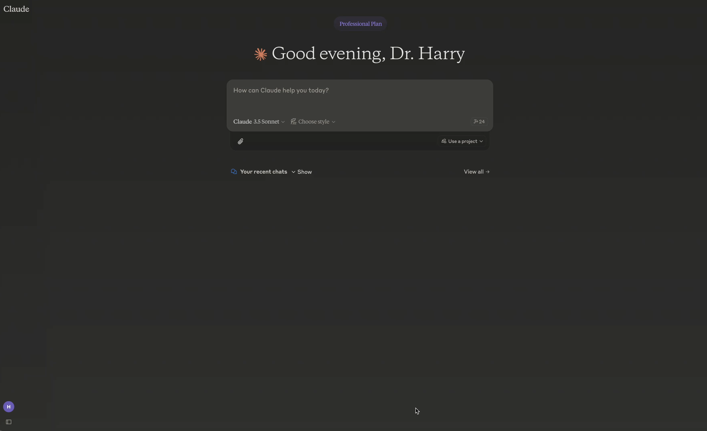
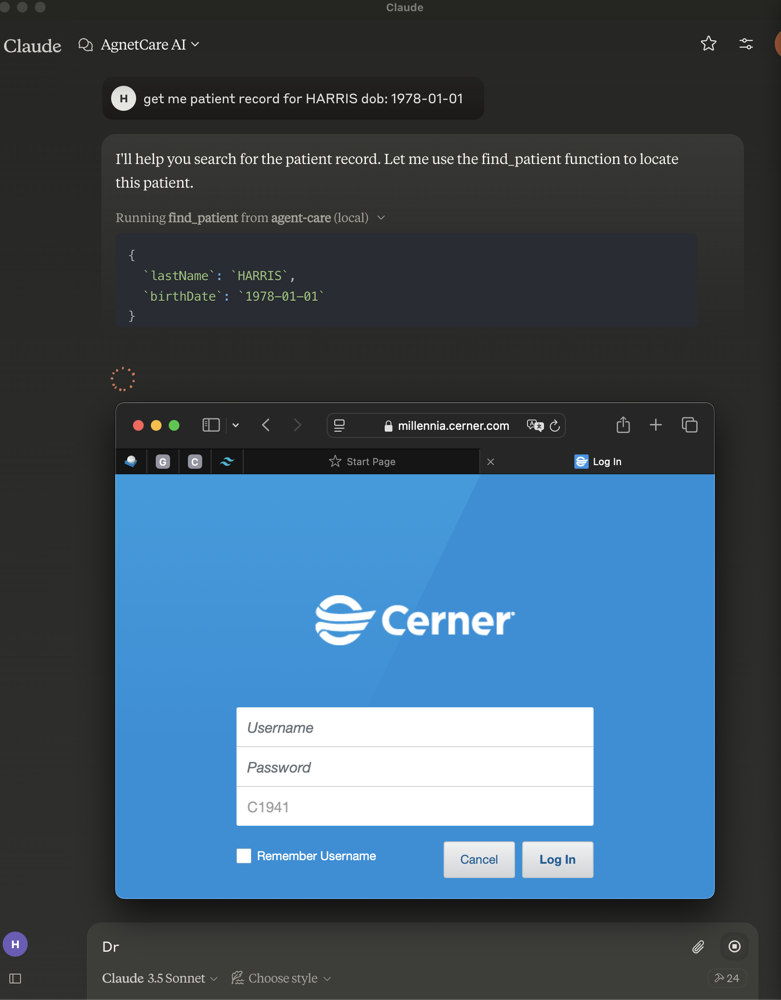
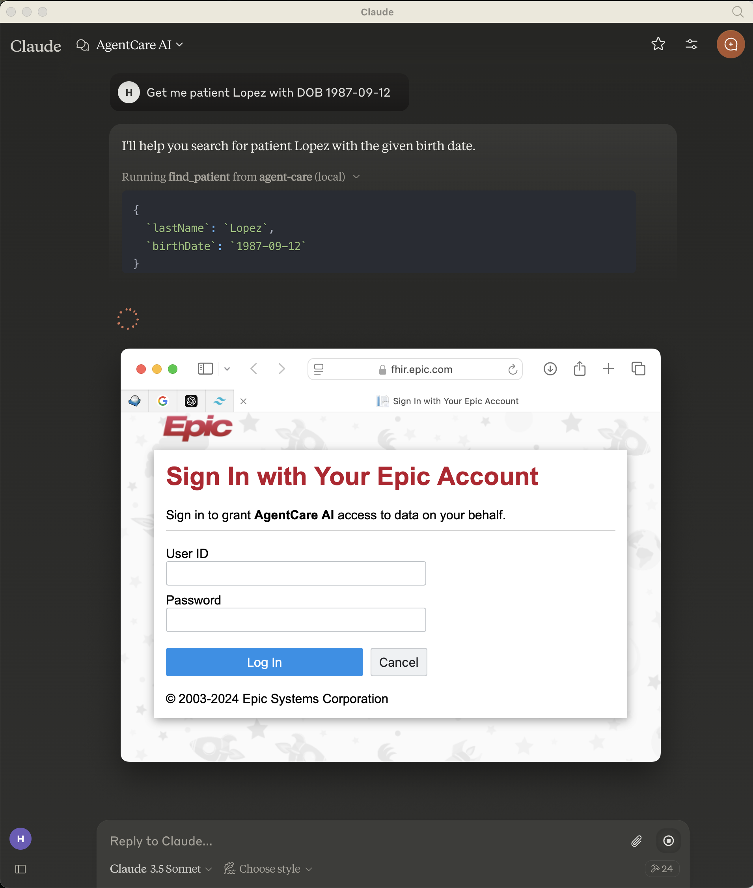
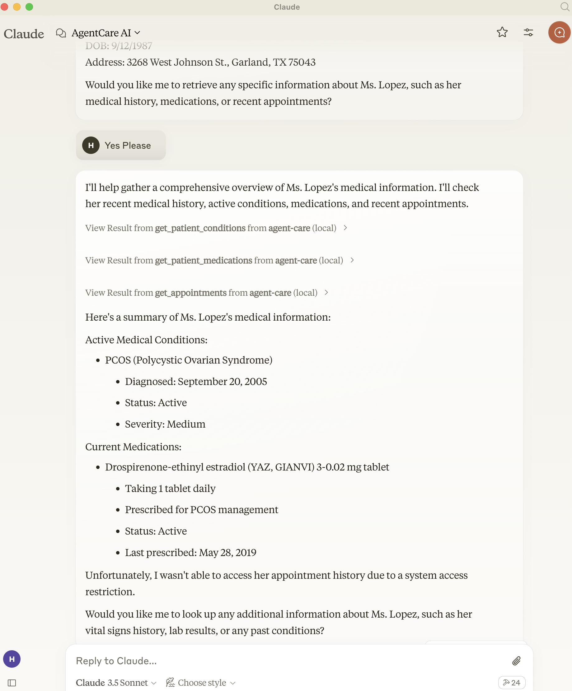
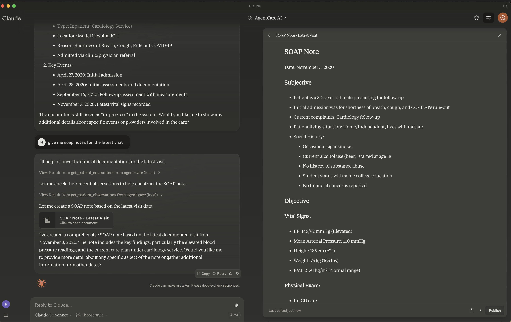
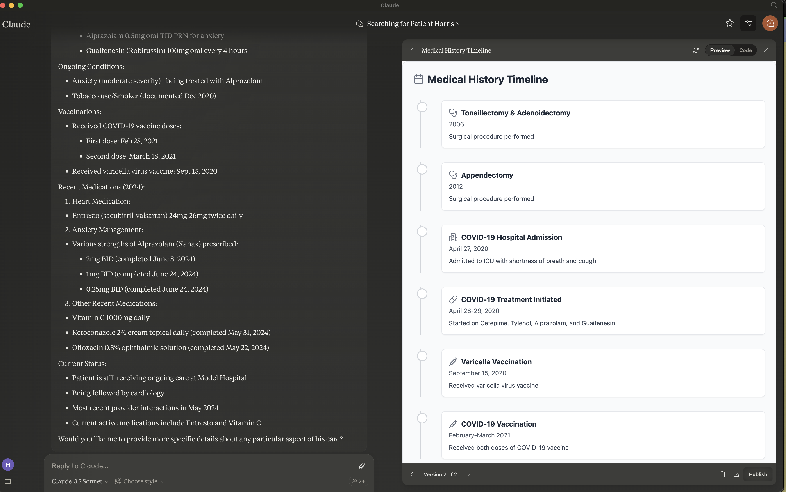

# Agent Care: An MCP Server for EMRs like Cerner and Epic

A Model Context Protocol (MCP) server that provides healthcare tools and prompts for interacting with FHIR data and medical resources on EMRs like Cerner and Epic.

## Demo
[](https://www.agentcare.ai/demo.mp4)

## Features
- EMR integrartion using SMART on FHIR APIs
- Uses OAuth2 to authenticate with EMRs 
- Anthropic Claude Desktop integration
- Medical research integration (PubMed, Clinical Trials, FDA)
- Response caching
- Error handling
- Null-safe data formatting
- Comprehensive clinical analysis

## Screenshots







## Tools

### FHIR Tools
- `find_patient` - Search for a patient by name, DOB, or other identifiers
- `get_patient_observations` - Retrieve patient observations/vital signs
- `get_patient_conditions` - Get patient's active conditions
- `get_patient_medications` - Get patient's current medications
- `get_patient_encounters` - Get patient's clinical encounters
- `get_patient_allergies` - Get patient's allergies and intolerances
- `get_patient_procedures` - Get patient's procedures
- `get_patient_careteam` - Get patient's care team members
- `get_patient_careplans` - Get patient's active care plans
- `get_vital_signs` - Get patient's vital signs
- `get_lab_results` - Get patient's laboratory results
- `get_medications_history` - Get patient's medication history
- `clinical_query` - Execute custom FHIR queries

### Medical Research Tools
- `search-pubmed` - Search PubMed articles related to medical conditions
- `search-trials` - Find relevant clinical trials
- `drug-interactions` - Check drug-drug interactions

## Usage

Each tool  requires specific parameters:

### Required Parameters
- Most tools require `patientId`
- Some tools have additional parameters:
  - `lab_trend_analysis`: requires `labType`
  - `search-pubmed`: requires `query` and optional `maxResults`
  - `search-trials`: requires `condition` and optional `location`
  - `drug-interactions`: requires `drugs` array

## Development Configuration 
- To use with Cerener: Go to https://code-console.cerner.com and create a sandbox account, create a new provider app and get the clientId/secret.
(note: ec2458f2-1e24-41c8-b71b-0e701af7583d below is the tenant id for cerner developer sandbox)

- To use with Epic: Go to https://fhir.epic.com/Developer/Apps , sign up as developer and create a new app and get the clientId/secret.

- For PubMed, Clinical Trials and FDA, you need to get the API keys from the respective websites.
  - https://clinicaltrials.gov/api/v2/studies
  - https://eutils.ncbi.nlm.nih.gov/entrez/eutils
  - https://api.fda.gov/drug/ndc.json

For local testing Create a `.env` file in the root directory or use these environment variables in claude desktop launch configuration.
#### Cerner
````
OAUTH_CLIENT_ID="XXXXX",
OAUTH_CLIENT_SECRET="XXXXXXX",
OAUTH_TOKEN_HOST="https://authorization.cerner.com", 
OAUTH_AUTHORIZE_PATH="/tenants/ec2458f2-1e24-41c8-b71b-0e701af7583d/protocols/oauth2/profiles/smart-v1/personas/provider/authorize",
OAUTH_AUTHORIZATION_METHOD='header',
OAUTH_TOKEN_PATH="/tenants/ec2458f2-1e24-41c8-b71b-0e701af7583d/hosts/api.cernermillennium.com/protocols/oauth2/profiles/smart-v1/token",
OAUTH_AUDIENCE="https://fhir-ehr.cerner.com/r4/ec2458f2-1e24-41c8-b71b-0e701af7583d",
OAUTH_CALLBACK_URL="http://localhost:3456/oauth/callback",
OAUTH_SCOPES="user/Patient.read user/Condition.read user/Observation.read user/MedicationRequest.read user/AllergyIntolerance.read user/Procedure.read user/CarePlan.read user/CareTeam.read user/Encounter.read user/Immunization.read",
OAUTH_CALLBACK_PORT="3456"
FHIR_BASE_URL:any = "https://fhir-ehr.cerner.com/r4/ec2458f2-1e24-41c8-b71b-0e701af7583d" 
PUBMED_API_KEY=your_pubmed_api_key
CLINICAL_TRIALS_API_KEY=your_trials_api_key
FDA_API_KEY=your_fda_api_key
````
#### Epic
````
OAUTH_CLIENT_ID="XXXXXXX",
OAUTH_CLIENT_SECRET="",
OAUTH_TOKEN_HOST="https://fhir.epic.com",
OAUTH_AUTHORIZE_PATH="/interconnect-fhir-oauth/oauth2/authorize",
OAUTH_AUTHORIZATION_METHOD='body',
OAUTH_TOKEN_PATH="/interconnect-fhir-oauth/oauth2/token",
OAUTH_AUDIENCE="https://fhir.epic.com/interconnect-fhir-oauth/api/FHIR/R4",
OAUTH_CALLBACK_URL="http://localhost:3456/oauth/callback",
OAUTH_SCOPES="user/Patient.read user/Observation.read user/MedicationRequest.read user/Condition.read user/AllergyIntolerance.read user/Procedure.read user/CarePlan.read user/CareTeam.read user/Encounter.read user/Immunization.read",
OAUTH_CALLBACK_PORT=3456
FHIR_BASE_URL:any = "https://fhir.epic.com/interconnect-fhir-oauth/api/FHIR/R4" //EPIC  
PUBMED_API_KEY=your_pubmed_api_key
CLINICAL_TRIALS_API_KEY=your_trials_api_key
FDA_API_KEY=your_fda_api_key
````

## Start MCP Server Locally 
````
git clone {agentcare-mcp-github path}
cd agentcare-mcp
npm install
npm run build
````

## Use claude desktop
````
for claude desktop: 
macOS: ~/Library/Application Support/Claude/claude_desktop_config.json
(use the env variables as shown above)

{
  "mcpServers": {
    "filesystem": {
      "command": "npx",
      "args": [
        "-y",
        "@modelcontextprotocol/server-filesystem",
        "/Users/your-username/Desktop"
      ]
    },
    "agent-care": {
      "command": "node",
      "args": [
        "/Users/your-username/{agentcare-download-path}/agent-care-mcp/build/index.js"
      ],
      "env": {
        "OAUTH_CLIENT_ID": XXXXXX,
        "OAUTH_CLIENT_SECRET":XXXXXXX,
        "OAUTH_TOKEN_HOST":,
        "OAUTH_TOKEN_PATH":,
        "OAUTH_AUTHORIZE_PATH",
        "OAUTH_AUTHORIZATION_METHOD": ,
        "OAUTH_AUDIENCE":,
        "OAUTH_CALLBACK_URL":,
        "OAUTH_SCOPES":,
        "OAUTH_CALLBACK_PORT":,
        "FHIR_BASE_URL":,
        "PUBMED_API_KEY":,
        "CLINICAL_TRIALS_API_KEY":,
        "FDA_API_KEY":
      }
    }
  }
}
````
## Use MCP Inspectopr
(MCP Server using inspector. Make sure to update the .env file with the correct values.)
````
npm install -g @modelcontextprotocol/inspector
mcp-inspector  build/index.js
http://localhost:5173

````

## Test User Logins
(commonly used for sandbox/dev)
- Cerner: portal | portal 
- Epic: FHIRTWO | EpicFhir11! 

## Troubleshooting:
If Claude desktop is running it uses port 3456 for Auth. You need to terminate that process using the following command:
````
kill -9 $(lsof -t -i:3456)
````
